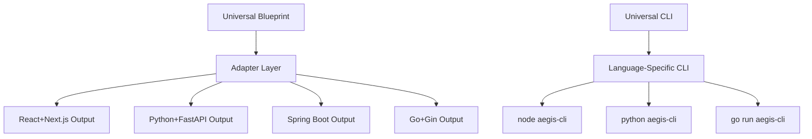

<!--
@aegisFrameworkVersion: 2.0.0-alpha-dev
@intent: Detailed technical requirements for removing tech stack bias
@context: Specific implementation tasks for achieving framework neutrality
-->

# 🔧 Tech Stack Neutrality: Detailed Implementation Requirements

## 🎯 Executive Summary

The Aegis Framework currently has **significant bias** toward the JavaScript/TypeScript + React + Next.js + Supabase stack. To achieve full reusability, we need **8 months of focused development** across 4 phases to implement universal adapters, abstract core dependencies, and create language-agnostic tooling.

## 📊 Current Bias Assessment: Critical Issues

### **🚫 Blocking Dependencies**

#### **1. CLI Tool Lock-in (HIGH IMPACT)**
```bash
# Current: Requires Node.js everywhere
node cli/team-config.ts
node cli/validate-team-config.ts
node tools/validate-blueprint.ts

# Problem: Python/Go/Rust teams cannot use framework tools
```

#### **2. Schema Validation Lock-in (HIGH IMPACT)**
```typescript
// Current: Zod everywhere in templates
import { z } from 'zod';
const schema = z.object({...});

// Problem: Non-TypeScript teams cannot use validation patterns
```

#### **3. Supabase-Specific Patterns (MEDIUM IMPACT)**
```typescript
// Mandatory in all templates
import { handleCorsPrelight } from '../_shared/lib/corsHeaders.ts';
export default async function handler(req: Request) {
  if (req.method === "OPTIONS") return handleCorsPrelight();
}

// Problem: Non-Supabase teams cannot use templates
```

#### **4. Build System Assumptions (MEDIUM IMPACT)**
```json
// All examples assume npm/package.json
{
  "scripts": {
    "build": "next build",
    "test": "jest"
  }
}

// Problem: Cargo/pip/Maven teams excluded
```

## 🏗️ Solution Architecture

### **Core Principle: Adapter Pattern + Universal Interfaces**



## 📝 Detailed Implementation Tasks

### **Phase 1: Foundation (Months 1-2)**

#### **Task 1.1: Universal Blueprint Schema**
**Current Problem**: Blueprints assume TypeScript/React patterns
**Solution**: Language-agnostic blueprint definitions

```yaml
# NEW: Universal blueprint format
apiVersion: "aegis.dev/v2"
kind: "Blueprint"
spec:
  interfaces:
    - name: "UserService"
      methods:
        - authenticate(credentials): AuthResult
        - getUserById(id): User
  
  components:
    - name: "UserForm"
      type: "form"
      fields: ["email", "password"]
  
  # Adapter-specific implementations
  adapters:
    react-next:
      components: ["LoginForm.tsx", "UserProfile.tsx"]
    python-fastapi:
      routes: ["/auth/login", "/users/{id}"]
    spring-boot:
      controllers: ["AuthController.java"]
```

**Implementation Requirements**:
- [ ] Design universal blueprint JSON schema
- [ ] Create blueprint validation for all adapters
- [ ] Update existing blueprints to universal format
- [ ] Create migration tool for legacy blueprints

#### **Task 1.2: Language-Agnostic CLI Protocol**
**Current Problem**: All CLI tools require Node.js
**Solution**: Protocol-based CLI with language adapters

```bash
# NEW: Universal CLI protocol
aegis-cli team-config         # Auto-detects language
aegis-cli validate-blueprint  # Works in any environment
aegis-cli hydrate-project     # Language-neutral migration
```

**Implementation Requirements**:
- [ ] Design CLI protocol specification (JSON/YAML based)
- [ ] Create reference Node.js implementation
- [ ] Create Python CLI adapter (`pip install aegis-cli`)
- [ ] Create Go CLI adapter (`go install aegis-cli`)
- [ ] Create Rust CLI adapter (`cargo install aegis-cli`)

#### **Task 1.3: Universal Configuration Schema**
**Current Problem**: Configuration assumes npm/Node.js ecosystem
**Solution**: Tech-stack agnostic configuration

```yaml
# NEW: Universal team configuration
apiVersion: "aegis.dev/v2"
kind: "TeamConfiguration"
spec:
  tech_stack:
    language: "python"        # or typescript, go, rust, java
    frontend: "react"         # or vue, angular, svelte
    backend: "fastapi"        # or django, spring, gin
    database: "postgresql"    # or mysql, sqlite, mongodb
    deployment: "aws"         # or vercel, gcp, azure
  
  features:
    core:
      blueprint_validation: true
    required:
      evolution_stories: 
        enabled: true
        adapter: "python"      # Uses Python tools
```

### **Phase 2: Primary Adapters (Months 3-4)**

#### **Task 2.1: Complete React+Next.js Adapter**
**Current Problem**: Templates hardcoded, not adapter-based
**Solution**: Full adapter implementation

```typescript
// NEW: adapters/react-next/blueprint-adapter.ts
export class ReactNextAdapter implements UniversalAdapter {
  translateBlueprint(blueprint: UniversalBlueprint): ReactNextOutput {
    return {
      components: this.generateComponents(blueprint.components),
      pages: this.generatePages(blueprint.routes),
      schemas: this.generateZodSchemas(blueprint.interfaces),
      styles: this.generateTailwindClasses(blueprint.styling)
    };
  }
  
  generateScaffold(blueprint: UniversalBlueprint): FileStructure {
    return {
      "src/components/": this.componentFiles,
      "src/pages/": this.pageFiles,
      "src/schemas/": this.schemaFiles,
      "package.json": this.packageJson
    };
  }
}
```

#### **Task 2.2: Python+FastAPI Adapter**
**Current Problem**: No Python implementation exists
**Solution**: Complete Python ecosystem adapter

```python
# NEW: adapters/python-fastapi/blueprint_adapter.py
class FastAPIAdapter(UniversalAdapter):
    def translate_blueprint(self, blueprint: UniversalBlueprint) -> FastAPIOutput:
        return FastAPIOutput(
            routers=self.generate_routers(blueprint.routes),
            models=self.generate_pydantic_models(blueprint.interfaces),
            dependencies=self.generate_dependency_injection(blueprint.services)
        )
    
    def generate_scaffold(self, blueprint: UniversalBlueprint) -> FileStructure:
        return {
            "app/routers/": self.router_files,
            "app/models/": self.model_files,
            "requirements.txt": self.requirements,
            "pyproject.toml": self.pyproject
        }
```

#### **Task 2.3: Go+Gin Adapter**
**Current Problem**: No Go implementation exists
**Solution**: Go ecosystem adapter

```go
// NEW: adapters/go-gin/blueprint_adapter.go
type GinAdapter struct{}

func (a *GinAdapter) TranslateBlueprint(blueprint UniversalBlueprint) GinOutput {
    return GinOutput{
        Routes:     a.generateRoutes(blueprint.Routes),
        Models:     a.generateStructs(blueprint.Interfaces),
        Middleware: a.generateMiddleware(blueprint.Middleware),
    }
}

func (a *GinAdapter) GenerateScaffold(blueprint UniversalBlueprint) FileStructure {
    return FileStructure{
        "cmd/server/":    a.serverFiles,
        "internal/api/":  a.apiFiles,
        "go.mod":         a.goMod,
    }
}
```

### **Phase 3: Ecosystem Expansion (Months 5-6)**

#### **Task 3.1: Additional Frontend Adapters**

**Vue + Nuxt Adapter**:
```typescript
// NEW: adapters/vue-nuxt/blueprint-adapter.ts
export class VueNuxtAdapter implements UniversalAdapter {
  translateBlueprint(blueprint: UniversalBlueprint): VueNuxtOutput {
    return {
      components: this.generateVueComponents(blueprint.components),
      pages: this.generateNuxtPages(blueprint.routes),
      composables: this.generateComposables(blueprint.services)
    };
  }
}
```

**Angular Adapter**:
```typescript
// NEW: adapters/angular/blueprint-adapter.ts
export class AngularAdapter implements UniversalAdapter {
  translateBlueprint(blueprint: UniversalBlueprint): AngularOutput {
    return {
      components: this.generateAngularComponents(blueprint.components),
      services: this.generateAngularServices(blueprint.services),
      modules: this.generateAngularModules(blueprint.modules)
    };
  }
}
```

#### **Task 3.2: Additional Backend Adapters**

**Spring Boot Adapter**:
```java
// NEW: adapters/spring-boot/BlueprintAdapter.java
public class SpringBootAdapter implements UniversalAdapter {
    public SpringBootOutput translateBlueprint(UniversalBlueprint blueprint) {
        return new SpringBootOutput(
            generateControllers(blueprint.getRoutes()),
            generateEntities(blueprint.getInterfaces()),
            generateServices(blueprint.getServices())
        );
    }
}
```

**Django Adapter**:
```python
# NEW: adapters/django/blueprint_adapter.py
class DjangoAdapter(UniversalAdapter):
    def translate_blueprint(self, blueprint: UniversalBlueprint) -> DjangoOutput:
        return DjangoOutput(
            views=self.generate_views(blueprint.routes),
            models=self.generate_django_models(blueprint.interfaces),
            urls=self.generate_url_patterns(blueprint.routes)
        )
```

### **Phase 4: Enterprise Support (Months 7-8)**

#### **Task 4.1: Enterprise Platform Adapters**

**.NET Core Adapter**:
```csharp
// NEW: adapters/dotnet-core/BlueprintAdapter.cs
public class DotNetCoreAdapter : IUniversalAdapter
{
    public DotNetCoreOutput TranslateBlueprint(UniversalBlueprint blueprint)
    {
        return new DotNetCoreOutput
        {
            Controllers = GenerateControllers(blueprint.Routes),
            Models = GenerateModels(blueprint.Interfaces),
            Services = GenerateServices(blueprint.Services)
        };
    }
}
```

**Kubernetes-Native Adapter**:
```yaml
# NEW: adapters/kubernetes/blueprint-adapter.yaml
apiVersion: aegis.dev/v2
kind: KubernetesAdapter
spec:
  generateManifests: true
  generateHelm: true
  generateKustomize: true
  
  templates:
    deployment: "templates/deployment.yaml"
    service: "templates/service.yaml"
    ingress: "templates/ingress.yaml"
```

## 🛠️ Critical Dependencies to Abstract

### **1. Schema Validation Abstraction**
```yaml
# Current: Zod-specific
validation:
  library: "zod"
  types: "TypeScript"

# Target: Universal
validation:
  spec: "json-schema"
  adapters:
    typescript: "zod"
    python: "pydantic"
    go: "github.com/go-playground/validator"
    java: "hibernate-validator"
    rust: "serde"
```

### **2. Database Abstraction**
```yaml
# Current: Supabase-specific
database:
  provider: "supabase"
  auth: true
  realtime: true

# Target: Universal
database:
  type: "postgresql"
  adapters:
    supabase: { auth: true, realtime: true }
    prisma: { migrations: true, client: true }
    sqlalchemy: { orm: true, migrations: "alembic" }
    gorm: { autoMigrate: true }
```

### **3. Authentication Abstraction**
```yaml
# Current: Supabase Auth
auth:
  provider: "supabase"
  social: ["google", "github"]

# Target: Universal
auth:
  provider: "auth0"  # or supabase, firebase, cognito
  adapters:
    supabase: { social: ["google", "github"] }
    auth0: { universal_login: true }
    firebase: { phone_auth: true }
    custom: { jwt: true }
```

### **4. Deployment Abstraction**
```yaml
# Current: Vercel/Supabase deployment
deployment:
  platform: "vercel"
  functions: "edge"

# Target: Universal
deployment:
  platform: "aws"  # or vercel, gcp, azure
  adapters:
    vercel: { edge_functions: true }
    aws: { lambda: true, api_gateway: true }
    gcp: { cloud_functions: true }
    azure: { functions: true }
```

## 📋 Migration Strategy for Existing Projects

### **Backward Compatibility Requirements**
1. **Existing blueprints must continue working**
2. **Current CLI tools must have deprecation path**
3. **Migration tools for upgrading to universal format**

### **Migration Tooling**
```bash
# Automated migration tools
aegis-migrate detect-stack           # Analyze current project
aegis-migrate convert-blueprint      # Convert to universal format
aegis-migrate suggest-adapters       # Recommend optimal tech stack
aegis-migrate validate-migration     # Verify constitutional compliance
```

## 🎯 Success Criteria

### **Technical Validation**
- [ ] Same blueprint generates working code in 5+ tech stacks
- [ ] Constitutional compliance maintained across all adapters
- [ ] Performance parity within 10% across tech stacks
- [ ] 100% test coverage for adapter interface compliance

### **Adoption Validation**
- [ ] 3+ production teams using non-React adapters
- [ ] Migration success rate >90% for existing projects
- [ ] Community contributions for 2+ additional adapters
- [ ] Documentation coverage for all supported tech stacks

### **Quality Validation**
- [ ] Zero constitutional violations across adapters
- [ ] Identical functionality across tech stack implementations
- [ ] Cross-adapter blueprint compatibility >95%
- [ ] Framework evolution stories capture multi-stack insights

This implementation plan transforms Aegis Framework from a **React+Next.js+Supabase tool** into a **truly universal AI engineering framework** that can support any modern tech stack while maintaining its core constitutional governance and blueprint-driven development principles.
