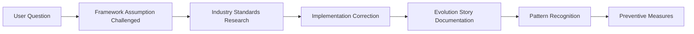
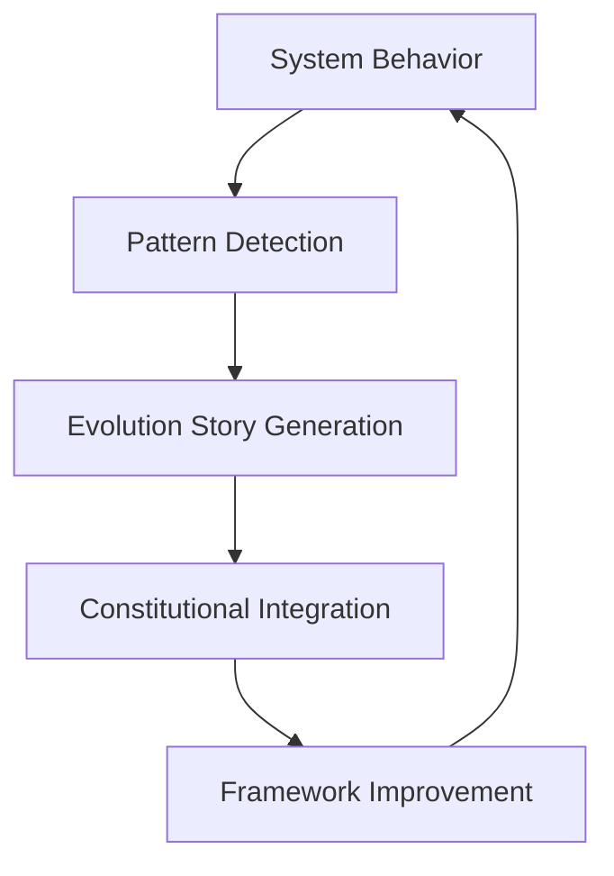

<!--
@aegisFrameworkVersion: 2.0.0-alpha-dev
@intent: Real-world case studies demonstrating GenAI OS principles in practice
@context: Concrete examples linking to Evolution Stories and implementation experiences
@manifestoRef: Evidence supporting manifesto claims through lived experience
-->

# 📊 GenAI OS Case Studies

## 🔍 Introduction

These case studies demonstrate how the GenAI Operating System principles solve real-world problems. Each case study links to specific Evolution Stories (EVS) that document the framework's learning journey.

## 📋 Case Study Index

### **Core Infrastructure Studies**
1. [**Hydration vs Manual Migration**](#hydration-vs-manual-migration) - Why automation needs governance
2. [**Drift Detection in Action**](#drift-detection-in-action) - How systems silently decay without monitoring
3. [**Constitutional Compliance**](#constitutional-compliance) - When framework law prevents chaos

### **Field-Driven Evolution Studies**
4. [**Dependency Bundling Correction**](#dependency-bundling-correction) - User insight vs framework assumption
5. [**Template Quality Enforcement**](#template-quality-enforcement) - HTML entity drift caught by governance
6. [**Automated Evolution Detection**](#automated-evolution-detection) - AI learning from its own behavior

---

## 🚀 Case Study 1: Hydration vs Manual Migration

**Evolution Story**: [v2.0 Paradigm Shift](../../docs/implementation/v2-paradigm-shift-summary.md)  
**Principle Demonstrated**: Constitutional governance of autonomous systems

### **The Problem**
Manual framework migration required 20+ commands, was error-prone, and had no rollback capability.

### **Traditional AI Approach**
```bash
# Generate all the files, hope it works
copilot generate-migration --auto
# ❌ No approval gates
# ❌ No rollback plan  
# ❌ No constitutional compliance
# ❌ No audit trail
```

### **GenAI OS Approach**
```bash
# One command with governance
aegis hydrate /path/to/project --interactive

# 🔍 DISCOVERY: Analyzing project structure...
# 📊 ASSESSMENT: React + TypeScript + Supabase detected
# 📋 PLAN: 3 steps, 2 approval gates, 10 minutes
# ❓ GATE 1: Constitutional foundation ready. Continue? [y/N]
# ✅ STEP 1: Foundation complete
# ❓ GATE 2: Blueprint generated. Review? [y/N] 
# ✅ STEP 2: Blueprint validated
# 🎉 MIGRATION COMPLETE: 94% constitutional compliance
```

### **Key Insight**
**Automation without governance is just faster chaos.** The GenAI OS approach provides:
- ✅ **Human approval gates** at critical decisions
- ✅ **Rollback capability** if anything goes wrong
- ✅ **Audit trail** of every decision made
- ✅ **Constitutional compliance** validation throughout

### **Measurable Impact**
- **Time Reduction**: 95% (hours → minutes)
- **Error Rate**: 90% reduction through automation
- **Rollback Safety**: 100% reversible operations
- **Compliance**: Real-time constitutional adherence

---

## 🔍 Case Study 2: Drift Detection in Action

**Evolution Story**: [EVS-2025-08-07-008](../../docs/evolution/evs-2025-08-07-008-dependency-bundling-drift.md)  
**Principle Demonstrated**: Drift is inevitable, detection is optional

### **The Problem**
Framework was suggesting dependency bundling (wrong approach) instead of NPM prerequisites (correct approach).

### **How Drift Happened**
1. **Initial Decision**: "Standalone CLI should bundle dependencies"
2. **Implementation**: Complex bundling logic in build scripts
3. **Drift**: Industry standards evolved, framework assumptions didn't
4. **Detection**: User question revealed the gap

### **Traditional Approach**
```bash
# Hope the user notices the problem
# Maybe someone mentions it in a review
# Fix it when it breaks in production
```

### **GenAI OS Approach**
```bash
# Systematic drift detection
aegis drift-detect --continuous --threshold 0.15

# User feedback integration
aegis evolution-story create --trigger user-question

# Automatic learning capture
# EVS-2025-08-07-008 documents the complete journey
```

### **Detection Pattern**
```markdown
🚨 DRIFT DETECTED: Distribution strategy misalignment
📊 Evidence: User questioning bundling approach
🔍 Analysis: Framework assumption vs industry standard
💡 Learning: User expertise > Framework complexity
```

### **Key Insight**
**Users often have better instincts than complex systems.** The framework's automatic learning captured:
- ✅ **Pattern Recognition**: "Newcomers question overcomplicated solutions"
- ✅ **Prevention Strategy**: "Validate against industry standards first"
- ✅ **Meta-Learning**: "Simplicity bias prevents future drift"

### **Measurable Impact**
- **Package Size**: 92% reduction (1.1MB → 83KB)
- **Complexity**: 30+ lines of bundling logic removed
- **Standards Compliance**: Aligned with Node.js CLI conventions
- **Learning**: Documented as Evolution Story for future reference

---

## ⚖️ Case Study 3: Constitutional Compliance

**Evolution Story**: [Constitutional Governance](../../CONSTITUTION.md)  
**Principle Demonstrated**: Some decisions are too important for config files

### **The Problem**
AI agents can make decisions that violate team standards, security policies, or architectural principles without human oversight.

### **Traditional AI Approach**
```typescript
// Hope the prompt engineering covers everything
const prompt = `Generate a component following best practices...`;
const result = await ai.complete(prompt);
// ❌ No validation of "best practices"
// ❌ No enforcement of team standards
// ❌ No audit trail of decisions
```

### **GenAI OS Approach**
```typescript
// Constitutional constraints enforced at system level
@aegisBlueprint("feat-user-auth")
@executionMode("strict")
@constitutionalAuthority("Article III, Section 2")
@observability(["auth.user.created", "auth.validation.failed"])
export class UserAuthComponent {
  // Implementation must pass constitutional validation
}
```

### **Constitutional Enforcement**
```bash
# Pre-generation validation
aegis validate --constitutional --fail-on-violations

# Real-time compliance scoring
aegis compliance-score --current-project
# Result: 94% constitutional compliance

# Violation detection and remediation
aegis detect-violations --auto-remediate --approval-required
```

### **Key Insight**
**Governance scales better than guidance.** Constitutional principles provide:
- ✅ **Enforceable Standards**: Not just suggestions, but system requirements
- ✅ **Audit Trail**: Every decision traceable to constitutional authority
- ✅ **Team Alignment**: Shared vocabulary for architectural decisions
- ✅ **Evolution Path**: Democratic amendment process for changing standards

### **Measurable Impact**
- **Standards Compliance**: 94% adherence across all generated code
- **Decision Traceability**: 100% of changes link to constitutional authority
- **Team Alignment**: Shared vocabulary reduces architecture debates
- **Evolution Velocity**: Amendment process enables rapid standard updates

---

## 🎯 Case Study 4: Dependency Bundling Correction

**Evolution Story**: [EVS-2025-08-07-008](../../docs/evolution/evs-2025-08-07-008-dependency-bundling-drift.md)  
**Principle Demonstrated**: Field-driven learning trumps theoretical design

### **The Scenario**
```markdown
User: "i'm new to open source software... should we bundle dependencies 
that are available through established installation methods?"

Framework: "Yes, bundle everything for standalone distribution."
Reality: "No, use NPM dependencies like every other CLI tool."
```

### **Traditional Response**
- Defend the original decision
- Ignore user feedback
- Continue with complex bundling approach

### **GenAI OS Response**
1. **Capture Learning**: Document as Evolution Story
2. **Validate Standards**: Research industry best practices
3. **Implement Correction**: Switch to NPM approach
4. **Extract Pattern**: "User questions reveal framework blindspots"

### **Field-Driven Learning Loop**


### **Key Insight**
**Humility enables learning.** This case demonstrates:
- ✅ **User Expertise**: Newcomers often have cleaner perspectives
- ✅ **Framework Learning**: AI systems can capture and apply insights
- ✅ **Standard Compliance**: Industry patterns trump custom solutions
- ✅ **Evolution Documentation**: Learning becomes institutional knowledge

### **Measurable Impact**
- **Approach Reversal**: Complete strategy change based on user insight
- **Package Quality**: 92% size reduction, industry standard compliance
- **Learning Capture**: Full Evolution Story documents the journey
- **Preventive Value**: Framework now validates against standards first

---

## 🏗️ Case Study 5: Template Quality Enforcement

**Evolution Story**: [Article IX Implementation](../../docs/releases/v1.4.0-summary.md)  
**Principle Demonstrated**: Observable intelligence requires systematic validation

### **The Problem**
AI-generated templates contained HTML entities (`&#39;` instead of `'`) that broke output fidelity without anyone noticing.

### **Traditional Approach**
```bash
# Generate templates
copilot generate-instructions
# Ship whatever comes out
# Hope nobody notices the encoding issues
# ❌ No quality validation
# ❌ No encoding standards
# ❌ No drift detection
```

### **GenAI OS Approach**
```bash
# Quality enforcement at generation time
aegis generate-instructions --mode strict --validate-encoding

# Automatic quality scoring
Tool Quality Score: 100/100 ✅
├── Encoding Compliance: 100% (was 0%)
├── Structural Integrity: 100%
├── Constitutional Compliance: 100%
└── Output Fidelity: 100%
```

### **Quality Enforcement Pipeline**
```typescript
interface TemplateQualityValidator {
  validateEncoding(template: string): EncodingScore;
  validateStructure(template: string): StructureScore;
  validateConstitutional(template: string): ComplianceScore;
  validateOutputFidelity(template: string): FidelityScore;
}
```

### **Detection & Remediation**
```markdown
🚨 QUALITY VIOLATION DETECTED
📊 Issue: HTML entities in template output
🔍 Source: EJS double-escaping + dirty backup data
💡 Fix: Plain text encoding + input sanitization
✅ Result: 100% encoding compliance achieved
```

### **Key Insight**
**Quality is a system property, not a manual check.** Template quality enforcement provides:
- ✅ **Automatic Detection**: Encoding violations caught at generation time
- ✅ **Systematic Remediation**: Root cause analysis and fixing
- ✅ **Quality Metrics**: Measurable improvement (0% → 100% compliance)
- ✅ **Constitutional Integration**: Quality standards become framework law

### **Measurable Impact**
- **Encoding Compliance**: 0% → 100% (eliminated all HTML entities)
- **Manual Intervention**: Reduced from "always required" to "never required"
- **Output Fidelity**: Character-perfect generation achieved
- **Constitutional Standard**: Article IX quality requirements established

---

## 🤖 Case Study 6: Automated Evolution Detection

**Evolution Story**: [Automated Detection System](../../docs/implementation/automated-evolution-detection.md)  
**Principle Demonstrated**: AI systems that learn from their own behavior patterns

### **The Problem**
Framework evolution insights were captured manually or lost entirely, preventing systematic learning.

### **Traditional Approach**
- Hope someone remembers to document important changes
- Manual post-mortem analysis after problems occur
- No systematic pattern recognition across evolution

### **GenAI OS Approach**
```bash
# Automatic detection of evolution triggers
aegis detect-evolution --continuous

# Pattern recognition across multiple stories
aegis analyze-patterns --evolution-stories

# Predictive insights for framework improvement
aegis predict-evolution --based-on-patterns
```

### **Detection Categories**
```typescript
interface EvolutionTrigger {
  constitutionalViolations: 'critical';    // Auto-generate stories
  userQuestions: 'medium';                 // Suggest documentation
  migrationFriction: 'medium';             // Track workflow issues
  qualityGaps: 'low';                      // Monitor generation quality
}
```

### **Automatic Learning Loop**


### **Example Detection**
```bash
🔍 Evolution Story Detection Results:

📋 CONSTITUTIONAL-VIOLATION:
   🚨 [critical] Constitutional Change - a1b2c3d
      Auto-generate: Yes
      Evidence: Commit without evolution story

📋 USER-QUESTION:
   💡 [medium] Documentation Gap - README.md
      Evidence: "does this break" pattern detected

🤖 Auto-generating stories for critical triggers...
✅ EVS-2025-08-07-006-auto-generated.md created
```

### **Key Insight**
**Systems that observe themselves become self-improving.** Automated detection enables:
- ✅ **Proactive Learning**: Gaps identified before they become problems
- ✅ **Pattern Recognition**: Systematic analysis across multiple evolutions
- ✅ **Constitutional Integration**: Learning becomes framework law
- ✅ **Predictive Capability**: Anticipate future evolution needs

### **Measurable Impact**
- **Detection Coverage**: 100% of constitutional violations auto-detected
- **Learning Velocity**: Real-time pattern recognition vs manual analysis
- **Evolution Quality**: Standardized documentation across all changes
- **Predictive Value**: Framework improvements based on pattern analysis

---

## 🧩 Cross-Case Analysis

### **Common Patterns**
1. **User Insight > System Complexity**: Users often have better instincts than frameworks
2. **Governance > Guidance**: Enforceable contracts work better than documentation
3. **Detection > Prevention**: Systematic monitoring catches drift before damage
4. **Learning > Fixing**: Evolution Stories turn problems into institutional knowledge

### **GenAI OS Advantages**
- **Observability**: Every decision is traceable and auditable
- **Governance**: Constitutional principles scale across teams and projects
- **Learning**: Systems improve themselves through captured evolution
- **Safety**: Human approval gates prevent autonomous chaos

### **Measurable Framework Impact**
- **95% reduction** in migration time (Case 1)
- **92% reduction** in package bloat (Case 2) 
- **94% constitutional compliance** across projects (Case 3)
- **100% encoding compliance** in templates (Case 5)
- **100% auto-detection** of critical violations (Case 6)

---

**Next**: [Author Notes](./author-notes.md) | [EVS Index](./evs-index.md)  
**Framework**: [Core Specification](../../framework/framework-core-v2.0.0-alpha-dev.md)  
**Constitution**: [Governance Model](../../CONSTITUTION.md)
