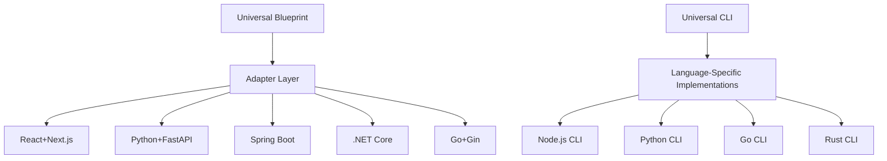

<!--
@aegisFrameworkVersion: 2.3.0-alpha-dev
@intent: Roadmap for implementing tech stack neutrality across the framework
@context: Future feature planning for universal adapter system and framework reusability
-->

# 🌐 Tech Stack Neutrality Roadmap

## 📋 Feature Overview

**Feature**: Universal Tech Stack Support  
**Status**: Future Feature (Planned for v3.0.0)  
**Priority**: High Impact, Strategic Initiative  
**Timeline**: 8 months (v3.0.0-alpha through v3.0.0-stable)

## 🎯 Strategic Objective

Transform Aegis Framework from its current React+Next.js+Supabase-biased architecture into a **truly universal AI engineering framework** that supports any modern tech stack while maintaining constitutional governance and blueprint-driven development principles.

## 📊 Current State Analysis

### **Critical Limitations**
- **JavaScript/TypeScript Lock-in**: All CLI tools require Node.js environment
- **React+Next.js Assumptions**: Templates and patterns are frontend-specific
- **Supabase Backend Dependency**: Mandatory authentication and deployment patterns
- **Ecosystem Bias**: Build tools, testing, and quality systems assume npm/Node.js

### **Impact on Adoption**
- **Blocked Teams**: Python, Go, Java, .NET teams cannot adopt framework
- **Limited Reusability**: Blueprints cannot translate across tech stacks
- **Ecosystem Fragmentation**: Framework creates technology silos

## 🏗️ Solution Architecture

### **Core Design Principle**: Universal Adapter Pattern

### **Implementation Strategy**
- **Phase-based rollout** over 8 months
- **Backward compatibility** for existing React+Next.js projects
- **Progressive enhancement** of adapter ecosystem
- **Community-driven** adapter development for additional tech stacks

## 📅 Implementation Timeline

### **Phase 1: Foundation (Months 1-2) - v3.0.0-alpha**
**Milestone**: Universal Interface Layer

**Deliverables**:
- [ ] Universal blueprint schema (language-agnostic)
- [ ] Cross-platform CLI protocol design
- [ ] Core adapter interface specifications
- [ ] Framework neutrality validation system

**Dependencies**:
- Framework architecture redesign
- Constitutional compliance system updates
- Migration tooling for existing blueprints

**Success Criteria**:
- Single blueprint definition works across multiple adapters
- CLI protocol documented and validated
- Existing React+Next.js functionality preserved

### **Phase 2: Primary Adapters (Months 3-4) - v3.0.0-beta**
**Milestone**: Core Tech Stack Support

**Deliverables**:
- [ ] React+Next.js adapter (complete implementation)
- [ ] Python+FastAPI adapter (full feature parity)
- [ ] Deno+Edge Functions adapter (complete)
- [ ] Go+Gin adapter (MVP implementation)

**Dependencies**:
- Phase 1 foundation completion
- Adapter testing framework
- Cross-stack validation tooling

**Success Criteria**:
- 4 production-ready adapters
- Blueprint compatibility >95% across adapters
- Constitutional compliance maintained

### **Phase 3: Ecosystem Expansion (Months 5-6) - v3.0.0-rc**
**Milestone**: Broad Tech Stack Coverage

**Deliverables**:
- [ ] Vue+Nuxt frontend adapter
- [ ] Angular frontend adapter
- [ ] Spring Boot backend adapter
- [ ] Django backend adapter
- [ ] Database abstraction layer (PostgreSQL, MySQL, MongoDB)
- [ ] Authentication provider abstraction (Auth0, Firebase, Cognito)

**Dependencies**:
- Primary adapter stability
- Community contribution framework
- Multi-stack testing infrastructure

**Success Criteria**:
- 8+ supported tech stacks
- Multi-stack project examples
- Community adapter contributions

### **Phase 4: Enterprise Support (Months 7-8) - v3.0.0-stable**
**Milestone**: Enterprise-Grade Universal Framework

**Deliverables**:
- [ ] .NET Core enterprise adapter
- [ ] Java Enterprise adapter
- [ ] Kubernetes-native deployment adapter
- [ ] Legacy system integration tooling
- [ ] Migration automation tools
- [ ] Enterprise documentation suite

**Dependencies**:
- Ecosystem expansion completion
- Enterprise security validation
- Performance optimization across stacks

**Success Criteria**:
- Enterprise production deployments
- Migration success rate >90%
- Performance parity within 10% across stacks

## 📋 Technical Implementation Phases

### **Foundation Layer Requirements**
1. **Universal Blueprint Schema**
   - Language-agnostic interface definitions
   - Cross-platform compatibility validation
   - Constitutional compliance across tech stacks

2. **Adapter Interface Specification**
   - Standardized translation protocols
   - Output validation frameworks
   - Configuration management systems

3. **CLI Neutrality System**
   - Protocol-based command execution
   - Language-specific implementation adapters
   - Universal configuration management

### **Adapter Development Standards**
1. **Mandatory Interface Implementation**
   - `translateBlueprint()`: Convert universal blueprints to tech-specific implementations
   - `generateScaffold()`: Create project structure and boilerplate
   - `validateOutput()`: Ensure constitutional compliance
   - `generateConfiguration()`: Tech-specific build/deploy configs

2. **Quality Requirements**
   - 90%+ test coverage for all adapters
   - Performance benchmarking against reference implementations
   - Constitutional compliance validation
   - Community contribution guidelines

3. **Documentation Standards**
   - Complete setup and usage guides
   - Migration documentation from existing tech stacks
   - Best practices and pattern libraries
   - Troubleshooting and debugging guides

## 🎯 Success Metrics & KPIs

### **Technical Metrics**
- **Adapter Coverage**: 8+ major tech stacks supported by v3.0.0-stable
- **Blueprint Portability**: 95%+ compatibility across all adapters
- **Performance Parity**: <10% performance difference between tech stacks
- **Constitutional Compliance**: 100% adherence across all implementations

### **Adoption Metrics**
- **Multi-Stack Usage**: 40%+ of teams using non-React adapters by Q2 2026
- **Ecosystem Diversity**: 5+ different primary tech stacks in production
- **Migration Success**: 90%+ successful migrations from existing projects
- **Community Contributions**: 2+ community-developed adapters by Q4 2026

### **Quality Metrics**
- **Zero Constitutional Violations**: Across all tech stack implementations
- **Documentation Coverage**: Complete guides for all supported stacks
- **Test Coverage**: 90%+ for framework core and all adapters
- **Performance Validation**: Automated benchmarking across stacks

## 🔗 Reference Documentation

### **Detailed Implementation Plans**
- **[Tech Stack Neutrality Plan](./tech-stack-neutrality-plan.md)**: Comprehensive implementation strategy and architecture design
- **[Tech Neutrality Detailed Requirements](./tech-neutrality-detailed-requirements.md)**: Specific technical tasks, migration strategies, and success criteria

### **Related Roadmap Items**
- **[Feature Configurability System](./feature-configurability-roadmap.md)**: Teams can configure which features to enable per tech stack
- **[Framework Evolution Stories](./v2-hydration-roadmap.md)**: Field-driven insights will inform adapter development priorities
- **[Constitutional Governance](../implementation/framework-evolution-recommendations.md)**: Governance principles maintained across all tech stacks

## 🚨 Risk Assessment & Mitigation

### **High-Impact Risks**
1. **Adapter Complexity Explosion**
   - **Risk**: Each new tech stack increases maintenance burden exponentially
   - **Mitigation**: Community-driven development, automated testing, standardized interfaces

2. **Constitutional Compliance Drift**
   - **Risk**: Different tech stacks may interpret governance differently
   - **Mitigation**: Universal compliance validation, automated constitutional checks

3. **Performance Fragmentation**
   - **Risk**: Some tech stacks may have significantly different performance characteristics
   - **Mitigation**: Benchmarking requirements, performance optimization guidelines

### **Medium-Impact Risks**
1. **Community Adoption Challenges**
   - **Risk**: Non-React communities may resist framework adoption
   - **Mitigation**: Tech-specific documentation, community partnerships, gradual rollout

2. **Migration Complexity**
   - **Risk**: Existing teams may struggle to adopt new universal format
   - **Mitigation**: Automated migration tools, backward compatibility, extensive documentation

## 🏆 Strategic Impact

### **Framework Leadership**
- **Industry First**: Pioneering universal AI engineering framework governance
- **Competitive Advantage**: Only framework supporting constitutional governance across all tech stacks
- **Community Growth**: Massive expansion of potential adopters across all major ecosystems

### **Ecosystem Benefits**
- **Developer Choice**: Teams can choose optimal tech stack without losing framework benefits
- **Knowledge Transfer**: Patterns and best practices shared across technology boundaries
- **Innovation Acceleration**: Cross-pollination of ideas between different tech communities

### **Long-term Vision**
This roadmap establishes Aegis Framework as the **universal standard for AI-governed software development**, transcending technology boundaries while maintaining the core principles of traceability, observability, and constitutional compliance that make the framework unique.

---

## 📅 Release Planning

| Release | Timeline | Scope | Key Features |
|---------|----------|--------|--------------|
| **v3.0.0-alpha** | Q1 2026 | Foundation | Universal interfaces, CLI protocol |
| **v3.0.0-beta** | Q2 2026 | Primary Adapters | React, Python, Go, Deno support |
| **v3.0.0-rc** | Q3 2026 | Ecosystem | Vue, Angular, Spring Boot, Django |
| **v3.0.0-stable** | Q4 2026 | Enterprise | .NET, Java Enterprise, Kubernetes |

**Next Steps**: Begin foundation design in Q4 2025, community feedback collection, and adapter specification development.
