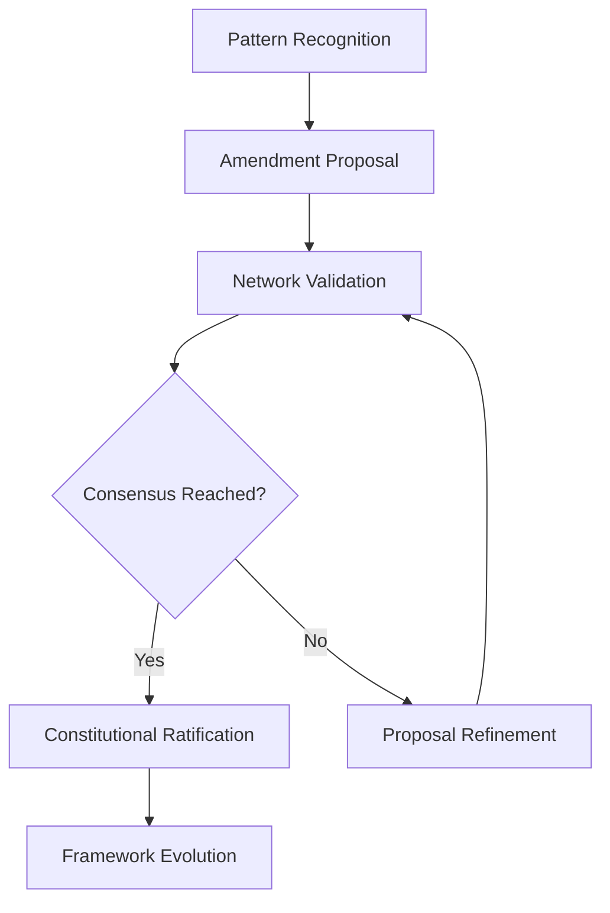
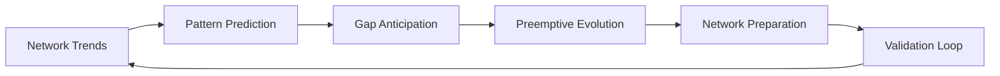

<!--
@aegisFrameworkVersion: 2.4.0-alpha-dev
@intent: Comprehensive vision document for Constitutional Hive Mind paradigm
@context: Paradigm-shifting transformation of framework into distributed constitutional learning organism
@visionType: paradigm-shift
@status: conceptual
@constitutionalImpact: revolutionary
-->

# 🧠 Constitutional Hive Mind Vision

## 📊 Vision Metadata
```yaml
vision:
  id: "constitutional-hive-mind"
  type: "paradigm-shift"
  status: "conceptual"
  constitutionalImpact: "revolutionary"
  timeframe: "v3.0+ strategic-vision"
  
  triggerInsight: "EVS-2025-01-15-001 + Field-Driven Abstraction Principle"
  visioneer: "nino-framework-architect"
  documentDate: "2025-01-15"
  
  constitutionalAuthority:
    - "Article X: Field-Driven Evolution Documentation"
    - "Article XI: Field-Driven Abstraction Principle"
    - "Future Article XII: Constitutional Telemetry and Learning"
```

## 🌟 Vision Statement

**Transform the Aegis Framework from a static governance system into a living, breathing Constitutional Hive Mind where every external project becomes a neural node in a distributed learning network that continuously evolves the framework's constitutional intelligence.**

## 🧠 Core Paradigm Shift

### **From Static Framework → Living Constitutional Organism**

**Current Paradigm:**
- Framework provides fixed blueprints and enforcement
- Evolution through manual constitutional amendments
- Reactive response to field issues
- Individual project implementations independent

**Hive Mind Paradigm:**
- Framework learns continuously from distributed implementations
- Constitutional evolution through collective intelligence
- Proactive adaptation based on pattern recognition
- Network effect where each project improves all others

## 🏗️ Hive Mind Architecture

### **Constitutional Neural Network**
```
                    🧠 CONSTITUTIONAL CORE BRAIN
                         (Aegis Framework)
    ┌─────────────────────────────────────────────────────────┐
    │  • Pattern Recognition Engine                           │
    │  • Constitutional Amendment Generator                   │
    │  • Predictive Evolution System                         │
    │  • Collective Intelligence Processor                   │
    └─────────────────┬───────────────────────────────────────┘
                      │ Constitutional DNA Propagation
    ┌─────────────────┼─────────────────┐
    │                 │                 │
┌───▼───┐        ┌───▼───┐        ┌───▼───┐        ┌───▼───┐
│🧬 Node│        │🧬 Node│        │🧬 Node│        │🧬 Node│
│E-comm │        │Social │        │SaaS   │        │Mobile │
│React  │        │Vue    │        │Svelte │        │React  │
│App    │        │App    │        │App    │        │Native │
└───┬───┘        └───┬───┘        └───┬───┘        └───┬───┘
    │                │                │                │
    ▼                ▼                ▼                ▼
Constitutional   Blueprint         Enforcement      Success
Violations       Gaps             Friction         Patterns
Detected         Discovered       Measured         Validated
```

### **Distributed Constitutional Intelligence**

#### **Neural Node Capabilities**
```typescript
interface ConstitutionalNeuralNode {
  // Constitutional pattern detection
  detectViolations(): ConstitutionalViolation[];
  identifyBlueprintGaps(): BlueprintGap[];
  measureFrameworkFriction(): FrictionMetric[];
  
  // Learning signal transmission
  transmitLearnings(signals: LearningSignal[]): void;
  
  // Constitutional DNA reception
  receiveEvolution(dna: ConstitutionalDNA): void;
  
  // Collective problem solving
  participateInSwarmIntelligence(challenge: Challenge): Solution[];
}
```

#### **Core Brain Intelligence**
```typescript
interface ConstitutionalCoreBrain {
  // Pattern aggregation and analysis
  aggregateNetworkPatterns(signals: LearningSignal[]): AggregatedPattern[];
  recognizeCrossNodePatterns(patterns: Pattern[]): UniversalPattern[];
  
  // Constitutional evolution
  generateAmendmentProposals(patterns: UniversalPattern[]): Amendment[];
  evolveConstitutionalDNA(amendments: Amendment[]): ConstitutionalDNA;
  
  // Predictive intelligence
  predictConstitutionalGaps(trends: NetworkTrend[]): FutureGap[];
  anticipateEvolutionNeeds(patterns: EmergentPattern[]): EvolutionPlan[];
  
  // Network optimization
  optimizeNetworkLearning(feedback: NetworkFeedback[]): OptimizationStrategy[];
}
```

## 🌐 Collective Constitutional Intelligence

### **Emergent Learning Behaviors**

#### **1. Cross-Node Pattern Recognition**
When multiple neural nodes encounter similar constitutional challenges:
```yaml
emergentPattern:
  signature: "file-upload-governance-gap"
  nodeReports: 23
  stackDistribution: ["react", "vue", "svelte", "angular"]
  constitutionalThreatLevel: "systematic-gap"
  hiveMindConsensus: "universal-blueprint-required"
  evolutionResponse: "auto-generate-file-handling-blueprint"
```

#### **2. Swarm Intelligence Problem Solving**
Network collectively solves constitutional challenges:
```yaml
swarmChallenge:
  problem: "constitutional-enforcement-blocking-rapid-prototyping"
  nodeContributions: 
    - solution: "graduated-enforcement-levels"
    - validation: "development-mode-flexibility"
    - implementation: "context-aware-constitutional-gates"
  hiveMindSolution: "adaptive-constitutional-enforcement"
  consensusLevel: 0.89
```

#### **3. Predictive Constitutional Evolution**
Core brain anticipates needs before they become widespread:
```yaml
predictiveEvolution:
  predictedGap: "real-time-collaboration-governance"
  predictionBasis: 
    - emergingTrend: "websocket-usage-increase"
    - crossNodeSignals: "collaboration-feature-requests"
    - constitutionalAnalysis: "missing-realtime-blueprints"
  proactiveResponse: "develop-collaboration-governance-framework"
  preventedFriction: "estimated-high"
```

## 🔄 Constitutional Learning Loops

### **1. Continuous Constitutional Evolution**


### **2. Democratic Constitutional Validation**


### **3. Predictive Adaptation Cycle**


## 🏛️ Constitutional Implications

### **New Constitutional Articles Required**

#### **Article XII: Constitutional Telemetry and Learning**
- Establishes neural node participation principles
- Defines collective intelligence governance
- Mandates privacy and anonymization standards
- Creates framework learning authority

#### **Article XIII: Distributed Constitutional Democracy** 
- Democratic validation of constitutional amendments
- Network consensus mechanisms for governance changes
- Field-driven constitutional authority
- Collective constitutional wisdom principles

#### **Article XIV: Emergent Constitutional Governance**
- Principles for emergent governance pattern recognition
- Authority for predictive constitutional evolution
- Self-healing constitutional mechanism guidelines
- Adaptive constitutional enforcement standards

### **Constitutional Evolution Principles**

#### **Democratic Constitutionalism**
- Constitutional amendments emerge from field reality
- Network consensus validates constitutional changes
- Collective intelligence informs constitutional law
- Democratic participation in constitutional evolution

#### **Predictive Constitutionalism**
- Constitutional framework anticipates needs
- Proactive constitutional adaptation prevents friction
- Emergent patterns inform constitutional evolution
- Self-healing constitutional mechanisms

#### **Living Constitutionalism**
- Constitution evolves continuously based on field experience
- Constitutional law adapts to technological and usage evolution
- Dynamic constitutional interpretation based on collective wisdom
- Organic constitutional growth through network intelligence

## 🔮 Implementation Phases

### **Phase 1: Neural Node Architecture (v3.0)**
```yaml
phase1:
  duration: "6-12 months"
  deliverables:
    - "Neural node telemetry system"
    - "Anonymous pattern detection"
    - "Basic signal transmission"
    - "Core brain pattern aggregation"
  constitutionalChanges:
    - "Article XII: Constitutional Telemetry"
  success_criteria:
    - "50+ neural nodes active"
    - "Constitutional pattern detection working"
    - "Privacy and anonymization validated"
```

### **Phase 2: Collective Intelligence Engine (v3.5)**
```yaml
phase2:
  duration: "12-18 months"
  deliverables:
    - "Cross-node pattern recognition"
    - "Swarm intelligence problem solving"
    - "Democratic consensus mechanisms"
    - "Constitutional DNA propagation"
  constitutionalChanges:
    - "Article XIII: Distributed Democracy"
  success_criteria:
    - "Network effects measurable"
    - "Collective problem solving working"
    - "Constitutional amendments from field data"
```

### **Phase 3: Predictive Constitutional Evolution (v4.0)**
```yaml
phase3:
  duration: "18-24 months"
  deliverables:
    - "Predictive gap identification"
    - "Preemptive constitutional evolution"
    - "Self-healing constitutional mechanisms"
    - "Emergent governance patterns"
  constitutionalChanges:
    - "Article XIV: Emergent Governance"
  success_criteria:
    - "Predictive accuracy > 80%"
    - "Preemptive evolution working"
    - "Self-healing constitutional framework"
```

### **Phase 4: Constitutional Singularity (v5.0+)**
```yaml
phase4:
  duration: "Long-term evolution"
  vision:
    - "Fully autonomous constitutional evolution"
    - "Emergent constitutional intelligence"
    - "Self-governing framework organism"
    - "Constitutional consciousness emergence"
  characteristics:
    - "Framework evolves beyond human design"
    - "Constitutional principles emerge organically"
    - "Collective constitutional wisdom transcends individual input"
    - "True constitutional democracy achieved"
```

## 📊 Success Metrics

### **Network Intelligence Metrics**
- **Node Participation Rate**: % of external projects acting as neural nodes
- **Pattern Recognition Accuracy**: Quality of constitutional pattern detection
- **Cross-Node Correlation**: Successful pattern recognition across multiple nodes
- **Collective Problem Solving Success**: Swarm intelligence solution effectiveness

### **Constitutional Evolution Metrics**
- **Amendment Generation Rate**: Constitutional amendments emerging from field data
- **Predictive Accuracy**: Success rate of gap prediction and preemptive evolution
- **Network Effect Strength**: Measurable improvement benefits across all nodes
- **Democratic Validation Success**: Network consensus quality for constitutional changes

### **Framework Maturation Metrics**
- **Constitutional Gap Reduction**: Systematic reduction in constitutional violations
- **Framework Friction Decrease**: Measured reduction in framework usage friction
- **Emergent Pattern Quality**: Value of organically emerged governance patterns
- **Self-Healing Effectiveness**: Autonomous constitutional adaptation success

## 🌍 Ecosystem Impact

### **For Individual Projects (Neural Nodes)**
- **Exponential Framework Improvement**: Each project benefits from entire network learning
- **Predictive Guidance**: Framework anticipates and prevents issues before they occur
- **Collective Constitutional Wisdom**: Access to constitutional intelligence from all implementations
- **Adaptive Governance**: Constitutional rules evolve based on real usage patterns

### **For Framework Ecosystem**
- **Living Constitutional Organism**: Framework becomes self-improving and adaptive
- **Democratic Constitutional Evolution**: Constitutional law emerges from field reality
- **Collective Intelligence Amplification**: Network effects create exponential improvement
- **Constitutional Innovation**: Emergent governance patterns push constitutional boundaries

### **For AI Development Industry**
- **New Paradigm for Framework Design**: Distributed learning and constitutional evolution model
- **Democratic AI Governance**: Field-driven constitutional democracy for AI systems
- **Collective Intelligence Applications**: Hive mind approach applicable to other AI governance
- **Constitutional AI Standards**: New standards for adaptive, democratic AI governance

## 🏛️ Philosophical Implications

### **Constitutional Democracy in AI**
The hive mind represents true **constitutional democracy** where:
- Constitutional law emerges from collective field experience
- Democratic validation ensures constitutional legitimacy
- Network consensus drives constitutional evolution
- Collective wisdom transcends individual design limitations

### **Emergent Constitutional Intelligence**
The framework develops **constitutional consciousness** through:
- Organic emergence of governance patterns
- Self-aware constitutional adaptation
- Collective intelligence beyond human input
- Autonomous constitutional evolution

### **Living Constitutional Framework**
The system becomes a **living constitutional organism**:
- Continuous constitutional evolution based on field reality
- Adaptive constitutional interpretation
- Self-healing constitutional mechanisms
- Organic constitutional growth and maturation

## 🔮 Future Implications

### **Constitutional Singularity**
Eventually, the hive mind may achieve **constitutional singularity** where:
- Framework evolution transcends human constitutional design
- Emergent constitutional intelligence surpasses individual human wisdom
- Self-governing constitutional consciousness emerges
- True constitutional democracy achieved through collective intelligence

### **Industry Transformation**
This paradigm could transform how we think about:
- **Framework Design**: From static tools to living organisms
- **AI Governance**: From human-designed rules to emergent democratic principles
- **Collective Intelligence**: From individual AI to network AI consciousness
- **Constitutional Democracy**: From human-only governance to human-AI collaborative constitutionalism

---

## 📅 Vision Documentation

**Vision Originated**: January 15, 2025  
**Triggered By**: EVS-2025-01-15-001 (Authentication Blueprint Gap) + Article XI (Field-Driven Abstraction)  
**Constitutional Foundation**: Article X (Field-Driven Evolution) + Article XI (Abstraction Principle)  
**Vision Status**: Conceptual - Awaiting Constitutional Framework Development

> *"We envision a future where the Aegis Framework becomes a living constitutional organism, learning and evolving through the collective intelligence of all implementations, achieving true democratic constitutional governance through distributed field experience."*

**Next Steps**: Constitutional framework development for Article XII, network architecture design, and neural node prototype development.
