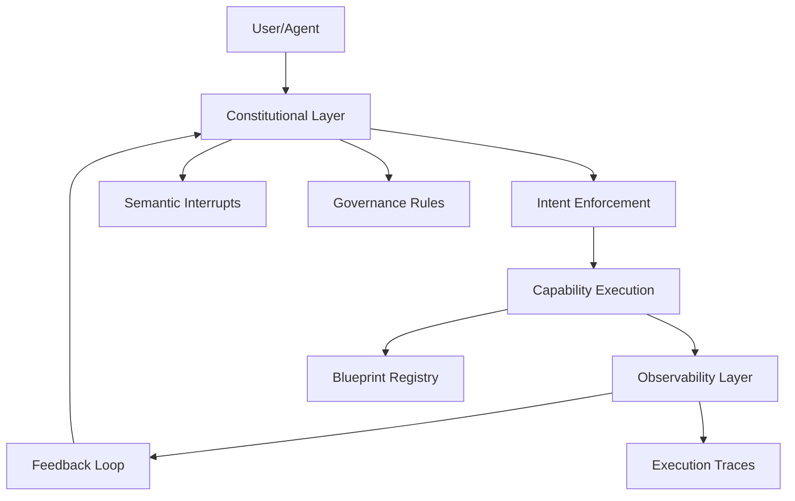

# Introduction to Aegis Framework

Welcome to **Aegis Framework v2.4.0** - a production-ready system for AI-assisted engineering with comprehensive governance, monitoring, and safety features.

## What is Aegis Framework?

Aegis Framework is designed to solve the challenges of integrating AI into complex software development workflows by providing:

- **Constitutional Governance**: Foundational principles with democratic amendment processes
- **Drift Detection & Prevention**: Real-time monitoring of agent behavior and intent alignment  
- **Configuration Management**: Team-configurable enforcement levels and feature controls
- **Version Consistency**: Automated validation across all framework files
- **Semantic Interrupt Handling**: Detection and response to user confusion or misalignment
- **Observability & Tracing**: Comprehensive monitoring and execution tracking

## Quick Start

### Installation

```bash
# Install globally
npm install -g @aegis-framework/cli@2.4.0

# Initialize in a project
aegis-hydrate /path/to/your/project
```

### Essential Commands

```bash
# Framework orientation
aegis-orient                    # Quick overview
aegis-orient detailed          # Comprehensive breakdown

# Live monitoring  
aegis-dashboard                 # Full dashboard
aegis-dashboard health          # Health check

# Core operations
aegis-conductor init            # Initialize framework
aegis-conductor check           # Run compliance checks
```

## Current Framework Status

import FrameworkStatus from '@site/src/components/FrameworkStatus';

<FrameworkStatus />

## Core Capabilities

The framework currently provides **64 capabilities** across **4 categories**:

- **🔧 Tools (38)**: CLI utilities, validation tools, enforcement engines
- **🏛️ Core (20)**: Framework foundations, specifications, templates  
- **⚖️ Governance (4)**: Constitutional enforcement, semantic interrupts
- **🔗 Integration (2)**: Blueprint implementations, external connections

## Key Features

### Constitutional Governance
- **Constitutional Compliance Enforcer**: Validates framework intelligence claims
- **Intent Enforcement Engine**: Real-time drift prevention and command validation
- **Democratic Amendment Engine**: Formal process for framework evolution

### Safety & Prevention
- **Semantic Interrupt Detector**: Responds to user expressions of confusion
- **Foreground Hang Prevention**: Prevents agent blocking on long-running processes
- **Self-Healing Governance**: Detects and prevents repeat failures

### Observability & Monitoring
- **Framework Capability Mapper**: Auto-discovers and catalogs capabilities
- **Execution Trace Hooks**: Real-time feature usage tracking
- **Live Dashboard**: Comprehensive framework monitoring

## Getting Started

1. **Explore the [Live Dashboard](/dashboard)** to see current framework status
2. **Browse [Capabilities](/docs/capabilities)** to understand available features
3. **Review [Blueprints](/docs/blueprints)** for implementation examples
4. **Check [Evolution Stories](/blog)** for framework development history

## Architecture Overview



## Next Steps

- **For New Users**: Start with the [Getting Started Guide](/docs/tutorial)
- **For Developers**: Explore the [API Documentation](/docs/api)
- **For Maintainers**: Review [Contributing Guidelines](/docs/contributing)

The Aegis Framework is designed to grow with your team while maintaining constitutional governance and safety principles. Every capability is monitored, every execution is traced, and every change respects the framework's foundational principles.